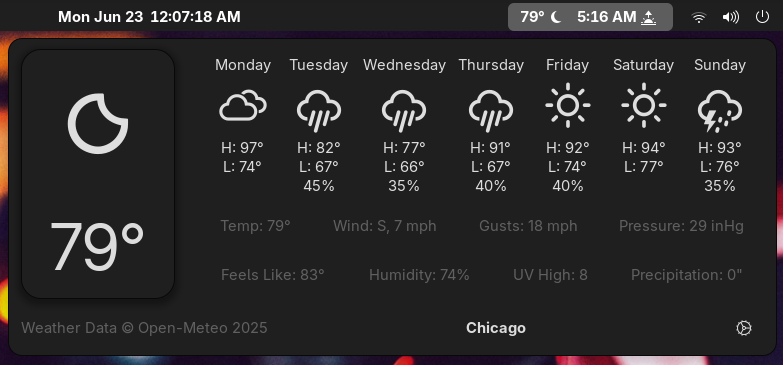
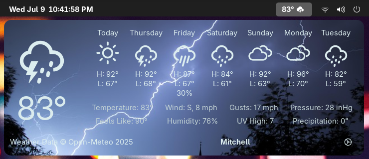
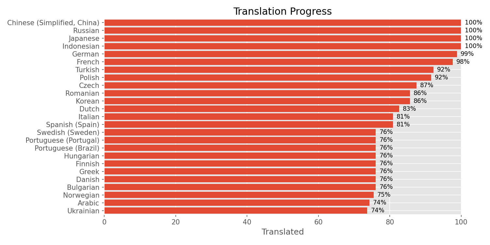

# SimpleWeather

A highly configurable GNOME shell extension for viewing the weather.

Support for themes, the following screenshot uses the *Immersive* theme:

SimpleWeather is highly configurable but has zero required setup.

## Installation

## Features

- Does not depend on GNOME Weather which eliminates location issues
- Display temperature and conditions in top bar
- Configure units (US, UK, Metric, Nordic, mix and match...)
- Automatically configures units based on country
- Use current location or add any number of locations and easily cycle through
- Show hourly and weekly forecast
- Configurable details like Rain Chance, Humidity, Wind Speed, UV, etc.
- Location lookup with Nominatim or use latitude/longitude

## Translations

Everybody is encouraged to make pull requests to add or fix
translations.

Many languages or dialects also do not exist in the project.

Check [AUTHORS](./AUTHORS) for a list of contributors.

## Building

Consult [`docs/building.md`](./docs/building.md).

## Contributing

Consult [`docs/source.md`](./docs/source.md) for relevant
source code information.

Everybody is encouraged to make pull requests to contribute
to the source code. If you plan to add a feature, it is a good
idea to make an [issue](https://github.com/romanlefler/SimpleWeather/issues)
first and label it as a feature request and add that you are willing
to do it (and perhaps how).

Check [AUTHORS](./AUTHORS) for a list of contributors.

