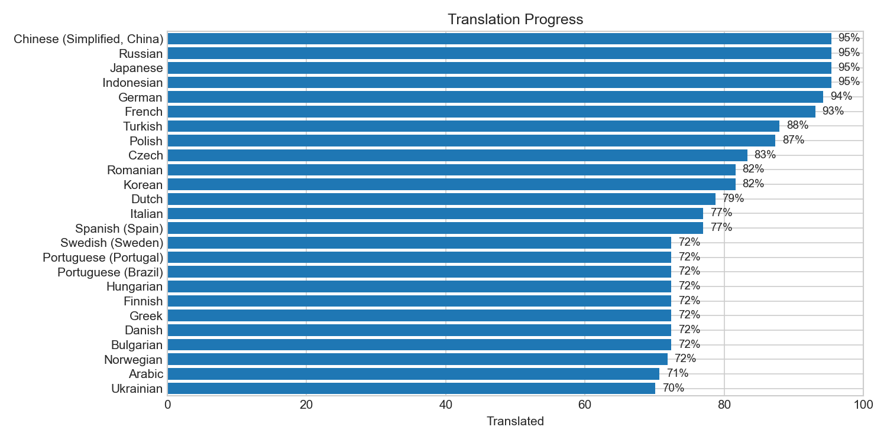

# SimpleWeather

A highly configurable weather extension for GNOME Shell, with hourly and
weekly forecasts, multiple locations, customizable weather details, and
multiple providers.

Consult the [gallery](./docs/gallery.md) for more screenshots.

## Features

### Weather & Forecasts

- View the current conditions in the top bar
- Hourly and weekly forecasts
- Configurable weather details, including rain chance, humidity, wind, and more

### Locations

- Use your current location or any number of saved locations
- Search for locations with Nominatim or enter latitude and longitude manually
- Does not use GNOME Weather, which lets you set any location in the world
- Quickly switch between saved locations

### Customization

- Choose from US, UK, Metric, Nordic, or a custom mix of units
- Auto-configuration selects the appropriate units based on your country
- Customize the details shown in the panel and pop-up
- Multiple themes and layouts, including a theme that looks like OpenWeather Refined

### Weather Providers

- Open-Meteo works out of the box with no API key
- OpenWeatherMap is available with your own [One Call 3.0 API key](https://home.openweathermap.org/subscriptions/unauth_subscribe/onecall_30/base)
- Does not depend on GNOME Weather

## Installation

### GNOME Extensions

The recommended way to install SimpleWeather is through the GNOME extensions website.

### Package Managers

SimpleWeather may also be available through distribution package managers.

> Package-manager versions are maintained by third parties and may not always
> match the latest upstream release.

- **ALT Linux Sisyphus**: [gnome-shell-extension-simple-weather](https://pkgs.org/download/gnome-shell-extension-simple-weather)
- **AUR** *(Arch Linux)*: [gnome-shell-extension-simpleweather](https://aur.archlinux.org/packages/gnome-shell-extension-simpleweather)
- **FreeBSD**: [gnome-shell-extension-simple-weather](https://www.freshports.org/deskutils/gnome-shell-extension-simple-weather/)

### Manual Installation

For development or manual installation, see [Building from Source](docs/building.md).

## Compatibility

SimpleWeather supports GNOME Shell versions 46, 48, 49, 50, and 51.

## Translations

Everybody is encouraged to make pull requests to add or fix
translations.

Many languages or dialects also do not exist in the project.

Check [AUTHORS](./AUTHORS) for a list of contributors.

## Building

Consult [`docs/building.md`](./docs/building.md).

## Contributing

Consult [`docs/source.md`](./docs/source.md) for relevant
source code information.

Everybody is encouraged to make pull requests to contribute
to the source code. If you plan to add a feature, it is a good
idea to make an [issue](https://github.com/romanlefler/SimpleWeather/issues)
first and label it as a feature request and add that you are willing
to do it (and perhaps how).

## License

Licensed under [GPL 3.0](./LICENSE).

Check [AUTHORS](./AUTHORS) for a list of contributors.

