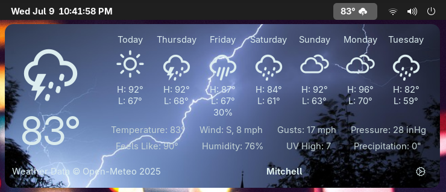

# SimpleWeather

A highly configurable GNOME shell extension for viewing the weather.

Support for themes, the following screenshot uses the *Immersive* theme:

## Features

- Display temperature and conditions in top bar
- Configure units
- Get current location or add any number of locations

## Translations

Many translations have been auto-generated using CrowdIn.
They are probably very bad; create pull requests to fix mistakes
or add missing translations.

Many languages or dialects also do not exist in the project.

Everybody is encouraged to make pull requests to add or fix
translations.

## Building

Consult [`docs/building.md`](./docs/building.md).

## Contributing

Consult [`docs/source.md`](./docs/source.md) for relevant
source code information.

Everybody is encouraged to make pull requests to contribute
to the source code. If you plan to add a feature, it is a good
idea to make an [issue](https://github.com/romanlefler/SimpleWeather/issues)
first and label it as a feature request and add that you are willing
to do it (and perhaps how).
